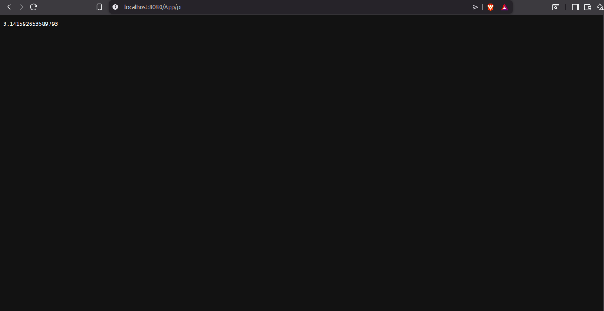
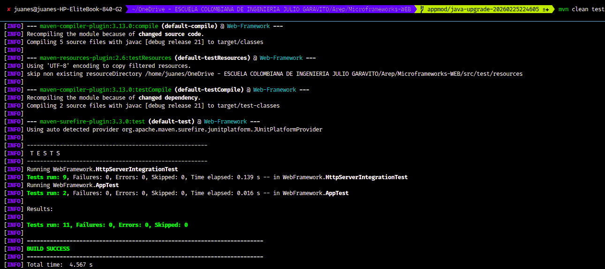

# Microframeworks-WEB

> A lightweight Java web framework built on top of a custom HTTP server — supporting lambda-based REST routes, query parameter extraction, and static file serving from the classpath.

---


## Overview

**Microframeworks-WEB** is a minimalist Java HTTP framework inspired by frameworks like Spark Java. It allows developers to spin up a web server, register REST endpoints using lambda functions, serve static assets, and handle HTTP errors — all with just a few lines of code.

---

## Features

| Feature | Description |
|---|---|
| Lambda REST routes | Define endpoints with `get(path, handler)` |
| Query parameter access | Read values via `req.getValues("key")` |
| Static file serving | Configure root with `staticfiles("/folder")` |
| Route prefix | Namespace routes with `setRoutePrefix("/App")` |
| HTTP status handling | Built-in `200`, `403`, `404`, `405`, `500` |
| MIME type detection | Automatic for `html`, `css`, `js`, `json`, `png`, `jpg`, `svg`, `ico`, and more |
| Path traversal protection | Blocks `/../` escape attempts |

---

## Project Structure

```
Microframeworks-WEB/
├── src/
│   ├── main/
│   │   ├── java/WebFramework/
│   │   │   ├── HttpServer.java          # Core server, routing, and response logic
│   │   │   ├── Request.java             # Request metadata and query parameter parsing
│   │   │   ├── Response.java            # Response status, content type, and headers
│   │   │   ├── WebMethod.java           # Functional interface for route handlers
│   │   │   └── Examples/
│   │   │       └── MathServices.java    # Demo application
│   │   └── resources/
│   │       └── webroot/
│   │           ├── index.html
│   │           ├── styles.css
│   │           ├── app.js
│   │           └── logo.png
│   └── test/
│       └── java/WebFramework/
│           ├── AppTest.java
│           └── HttpServerIntegrationTest.java
├── Assets/                              # Screenshot evidence
├── pom.xml
└── README.md
```

---

## Architecture

### Core Components

- **`HttpServer`** — Accepts connections, parses HTTP requests, dispatches to registered routes or static files, and writes responses. Manages server lifecycle (`start`, `startAsync`, `stop`).
- **`Request`** — Holds request method, path, protocol, headers, and a parsed query parameter map with URL decoding support.
- **`Response`** — Fluent API to set status code, content type, and custom headers before the handler returns.
- **`WebMethod`** — `@FunctionalInterface` for route handlers: `(Request, Response) -> String`.

### Request Flow

```
Client request
     │
     ▼
Parse request line + headers
     │
     ▼
Validate HTTP method  ──── Not GET ──▶  405 Method Not Allowed
     │
     ▼
Match registered REST route ────────▶  Execute lambda → 200 OK
     │ (no match)
     ▼
Resolve static file from classpath
     ├── Path traversal detected ──▶  403 Forbidden
     ├── File not found ───────────▶  404 Not Found
     └── File found ───────────────▶  200 OK + correct MIME type
```

---

## Requirements

- **Java 21**
- **Maven 3.9+**

---

## Getting Started

### 1. Clone the repository

```bash
git clone https://github.com/Juan-cely-l/Microframeworks-WEB.git
cd Microframeworks-WEB
```

### 2. Build and run tests

```bash
mvn clean test
```

### 3. Run the example application

```bash
mvn clean package
java -cp target/classes WebFramework.Examples.MathServices
```

The server starts at `http://localhost:8080`.

---

## API Reference

### `HttpServer.get(path, handler)`

Registers a GET route mapped to a lambda handler.

```java
get("/hello", (req, res) -> "Hello " + req.getValues("name"));
```

### `HttpServer.staticfiles(folder)`

Sets the classpath folder used to resolve static files.

```java
staticfiles("/webroot");
// Resolves files from: target/classes/webroot/
```

### `HttpServer.setRoutePrefix(prefix)`

Prepends a prefix to all registered routes.

```java
setRoutePrefix("/App");
// Routes become: /App/hello, /App/pi, etc.
```

### `Request.getValues(key)`

Returns the first value for a query parameter, or `""` if absent.

```java
// GET /App/hello?name=Pedro
req.getValues("name"); // → "Pedro"
```

### `Request.getAllValues(key)`

Returns all values for a repeated query parameter.

```java
// GET /search?tag=java&tag=maven
req.getAllValues("tag"); // → ["java", "maven"]
```

### `Response` (fluent)

```java
res.status(201).type("application/json").header("X-Custom", "value");
```

---

## Example Application

```java
public class MathServices {
    public static void main(String[] args) throws Exception {
        staticfiles("/webroot");
        setRoutePrefix("/App");

        get("/hello", (req, resp) -> "Hello " + req.getValues("name"));
        get("/pi",    (req, resp) -> String.valueOf(Math.PI));

        HttpServer.main(args);
    }
}
```

### Available endpoints

| Type | URL | Response |
|------|-----|----------|
| REST | `GET /App/hello?name=Peter` | `Hello Peter` |
| REST | `GET /App/pi` | `3.141592653589793` |
| Static | `GET /index.html` | HTML page |
| Static | `GET /styles.css` | Stylesheet |
| Static | `GET /app.js` | JavaScript |
| Static | `GET /logo.png` | Image (`image/png`) |

---

## Automated Tests

Tests are located in `src/test/java/WebFramework/` and cover:

| Test Class | What it covers |
|---|---|
| `AppTest` | Query parameter parsing, URL decoding, missing parameter defaults |
| `HttpServerIntegrationTest` | Full HTTP request/response cycle using raw byte processing |

### Integration test coverage

- `GET /App/hello?name=Peter` → `Hello Peter`
- `GET /App/hello` (no param) → `Hello `
- `GET /App/pi` → value of `Math.PI`
- `GET /index.html` → 200, `text/html`, contains expected content
- `GET /logo.png` → 200, `image/png`, non-empty body
- `GET /no-existe` → 404
- `POST /App/pi` → 405 with `Allow: GET` header
- `GET /../pom.xml` → 403 or 404 (path traversal blocked)
- `GET /App/hello?name=John+Smith` → `Hello John Smith` (URL decoding)

### Run all tests

```bash
mvn clean test
```

All tests pass. 

---

## Visual Evidence

### Static File Serving
The browser renders the static site served directly from `src/main/resources/webroot`.


### REST `/App/hello` with Query Parameter
Confirms `GET /App/hello?name=Peter` is resolved by the lambda route and reads query values correctly.


### REST `/App/pi`
Validates dynamic backend response generation from the `GET /App/pi` route.



### Automated Test Execution
Maven test run showing all tests passing.

